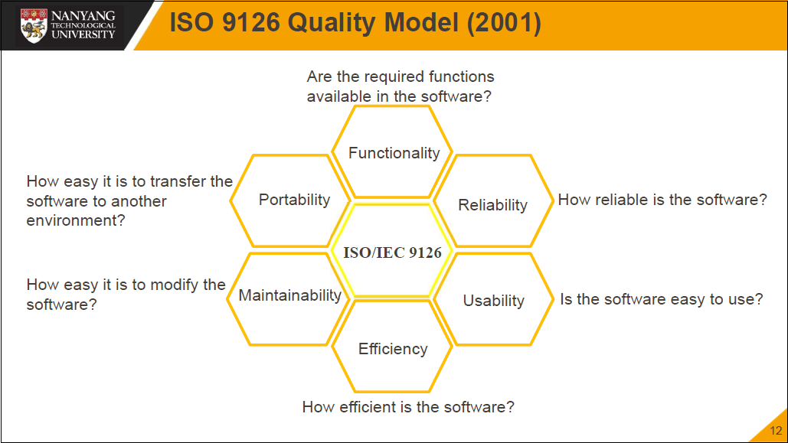
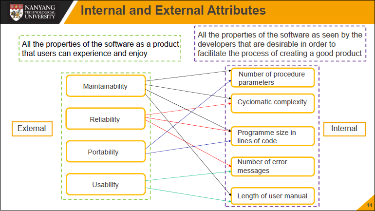
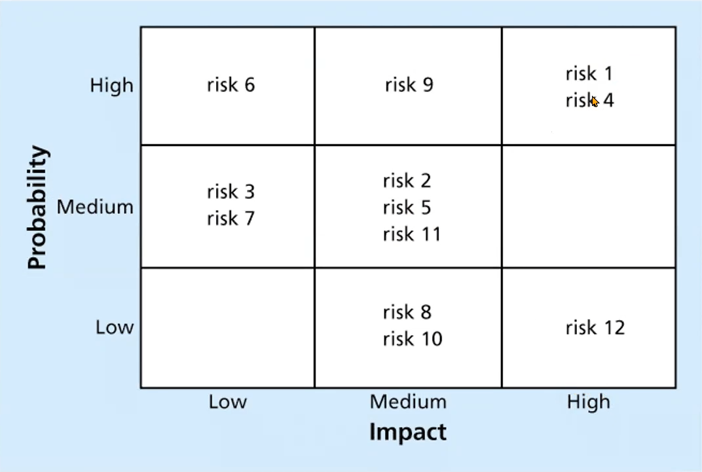

# CZ3002 Advanced Software Engineering

[toc]

## 0. Final Exam Specifications

-   4 questions * 25 marks
    -   3 to 4 sub-questions each
-   Suggested style of writing your answers:
    -   Point form with short elaboration
    -   \<keyword> - \<short elaboration>

## 1. Introduction to Advanced Software Engineering

​	Basic idea - **software engineering and project management is more important than technological skills**

### Software Development Components

​	A high quality products needs:

-   People
-   Processes
-   Technology

### Software Project Management

​	Core - managing activities to ensure that the software is delivered

-   On schedule
-   Within budget

### Management Activities

​	Software management includes:

-   Proposal writing
-   Project planning and scheduling
-   Project costing
-   Project monitoring and reviews
-   Personnel selection and evaluation
-   Report writing and presentations

### Project (Management) Lifecycle

​	Approval -> Initiation -> Planning -> Execution -> Completion

#### Approval

-   Assign PM
-   Define acceptance

#### Planning

-   Schedule
-   Resources
-   Dev Lifecycle
-   Process

#### Execution

-   Monitoring
-   Control
-   Development

#### Completion

-   Formal acceptance
-   Project summary

## 2. Classic Mistakes

### Categories

-   People
-   Process
-   Product
-   Technology

### People-related

-   most influential factor
-   Examples: weak personnel, crowded offices

### Process-related

-   includes methodologies of 
    -   management
    -   technical
-   influence on time, cost, and error rate
-   rework avoidance, quality assurance, etc.
-   Examples: insufficient risk management, overly optimistic schedules

### Product-related

-   factors
    -   size
    -   characteristic
-   Examples: gold-plating

### Technology-related

-   Examples: switching tools

## 3. Quality Management

​	Manage the product to **meet its specification and the customers' needs in a desired level**, especially by means of attention to every stage of the process

### Software Development Lifecycle

​	Planning -> Analysis -> Design -> Implementation -> Testing -> Maintenance

### Project Quality

​	The degree to which a set of inherent characteristics fulfils requirements

-   Conformance to requirements
-   Fitness for use

### ISO 9126 Quality Model (PURE-MF)

| **Characteristics** | **Description**                                              |
| ------------------- | ------------------------------------------------------------ |
| Portability         | The capability of the software product to be transferred from one environment to another. The environment may include organisation, hardware or software environment |
| Usability           | The capability of the software product to be understood, learned, used and attractive to the user, when used under specified conditions |
| Reliability         | The capability of the software product to maintain its level of performance under stated conditions for a stated period of time |
| Efficiency          | The capability of the software product to provide appropriate performance, relative to a number of resources used, under stated conditions |
| Maintainability     | The capability of the software product to be modified. Modifications may include corrections, improvements or adaptations of the software to changes in the environment and in the requirements and functional specifications |
| Functionality       | The capability of the software product to provide functions which meet stated and implied needs when the software is used under specified conditions |

### Software Quality Management

-   Quality control - concerned with ensuring that the required level of quality is achieved in a software product
-   Quality plan - involves defining appropriate quality standards and procedures and ensuring that these are followed
-   Quality assurance - aims to develop a "quality culture" where quality is seen as everyone’s responsibility

#### Quality Control

​	Check the software development process to ensure that procedures and standards are being followed

​	Two approaches

-   Quality reviews
-   Automated software assessment and software measurement

#### Performing Quality Assurance

​	**Quality Assurance** includes all activities related to satisfying the relevant quality standards of a project

-   Goal - continuous quality improvement
-   Benchmarking generates ideas for improvements
-   Quality audit reviews the quality management activities

### Capability Maturity Model

​	Contains 5 levels

-   Optimising
-   Managed
-   Defined
-   Repeatable
-   Initial

### Internal and External Attributes

-   External
    -   Maintainability
    -   Reliability
    -   Portability
    -   Usability
-   Internal
    -   Number of procedure parameters
    -   Cyclomatic complexity
    -   Programme size in LOC
    -   Number of error messages
    -   Length of user manual

### Software Metrics

​	Any type of measurement which relates to a software system, process, or related documentation

-   Allows quantifying processes
-   Can predict attributes or control processes
-   Helps in decision-making
-   Examples
    -   LOC
    -   Fan-in/fan-out

### Quality of Products

Defining the quality of a product

-   Identify quality criteria
-   Define quality assessment process
-   Review the quality of the product
-   Improve the quality of the product and the processes of the production

### Quality of Processes

Defining the quality of a process

-   Identify quality criteria
-   Define quality assessment process
-   Review the quality of the process
-   Improve the quality of the process

### Software Quality Assurance Plan

-   Purpose, scope, and quality objectives
-   Reference docs/standards
-   Organizational roles, responsibilities, and assessment mechanisms
-   Document standards/templates
-   Standard, processes, practices, conventions, and metrics
-   Review and audit
-   Others (if any)

### Controlling Quality

​	Main outputs

-   Acceptance decisions
-   Rework
-   Process adjustments

​	Seven Basic Tools

### The Cost of Quality

​	Cost = conformance + non-conformance

-   Conformance - delivering products that meet requirements and fitness for use

    修复产品和过程中与需求不一致的部分

-   Non-conformance - taking responsibility for failures or not meeting quality expectations

    修复质量不合格或者出错的部分

### Five Cost Categories Related to Quality

-   Prevention cost - cost of preventing error
-   Appraisal cost - cost of evaluating processes and their outputs
-   Internal failure cost - cost of fixing error before delivering
-   External failure cost - cost of fixing defects after delivering
-   Measurement and test equipment costs - cost of equipment used perform prevention and appraisal activities

## 4. Project Estimation - Function Points

### Project Estimation

-   Effort
-   Schedule
-   Resource
-   **Cost**

### Problems of Estimation

​	Estimations are difficult. Many are hurried and are based on assumptions. Managers and developers are usually overly optimistic

### Steps

-   Size
-   Effort
-   Duration
-   Manpower
-   Cost
-   Phase schedule

### Size by Function Points (FPs)

Function Point

-   Can be converted from use cases
-   a unit of measurement to express the amount of business functionality

5 Primary Elements

-   Inputs
-   Outputs
-   Inquiries
-   Logical files
-   Interfaces

### Unadjusted FP Total

​	Total score = $\sum$ of Complexity * No. of FPs

### Adjusted FP Total

-   Influence factors - factors that affect the complexity of the code
    -   14 identified factor
    -   each with a scoring from 0 to 5, indicating no influence to strong influence

​	Total score = $\sum$ of influence factors

​	Influence multiplier = total score * 0.01 + 0.65

​	**Total adjusted function points = unadjusted total * influence multiplier**

### Converting FP to LOC

​	LOC = FP * LOC per FP

### Estimation from FPs

#### From Size to Effort

​	Effort = size / production rate

-   Production rates can be obtained from
    -   benchmarks
    -   historical data

#### From Effort to Duration

​	Duration = $3.0 \times (\text{Effort}) ^ {1 \over 3}$

#### From Duration to Team Size

​	Team size = Effort / Duration

## 5. Project Estimation - COCOMO

​	COnstructive COst MOdel

​	Size + cost drivers + constraints and priorities -> effort + cost + schedule

​	Focusing on Step 5 and Step 6 (costs and phase schedule)

### Cost Drivers

-   Product attributes
-   Hardware attributes
-   Personnel attributes
-   Project attributes

### COCOMO 81

#### Basic Model

-   Effort $E = a (\text{KDSI})^b$
-   Duration $D = c(E)^d$
-   Recommended Staff Size $S = E / D$ 
-   $\text{KDSI}$ - thousand delivered source instruction

​	Constants are different for different models

-   Organic
-   Semi-detached
-   Embedded

#### Intermediate Model

-   Uses slightly different "a" constants
-   Adds "Effort Adjustment Factor" (EAF) 
    -   product of 15 cost drivers

-   Effort $E = a (\text{KDSI})^b \times \text{EAF}$
-   Duration $D = c(E)^d$

### COCOMO II 1997

-   Effort $= 2.94 \times \text{EAF} \times (\text{KSLOC})^E$
-   E is an exponent derived from the five scale drivers
-   Duration $D = 3.67 \times (\text{Effort})^\text{SE}$
-   SE is the schedule equation component derived from the five scale drivers

### Schedule Compression

-   Fast tracking
-   Crashing

## 6. Project Scheduling

​	Steps

-   Establish objectives
-   Breaking down project into tasks or work packages
-   Estimating time, resources and costs required to complete each task
-   Identifying precedence relationships and sequencing activities
-   Assigning tasks to team members

### Critical Path Method (CPM)

-   Network techniques
-   Consider precedence relationships and interdependencies

### Time-Cost Models

1.   Identify the critical path
2.   Find cost per time unit to expedite each node on critical path
3.   For cheapest node(s) to expedite, reduce it as much as possible, or until critical path changes
4.   Check for feasible savings

## 7. Project Planning

​	The most time-comsuming task. Continuous, must be revised regularly, contains various different types that may be developed

### Lifecycles

-   Waterfall
-   Agile

​	Select according to multiple factors

### Workbench

​	Begin -> lifecycle iterations -> end

### Importance of Risk Management

-   Project risk management is the art and science o**f identifying, analyzing, and responding to risk** throughout the life of a project in the best interests of meeting  project objectives
-   Often overlooked in projects, but it can help improve project success by helping select good projects, determining project scope, and developing realistic estimates

### Project Risk Management Processes

-   Planning risk management
-   Identifying risks
-   Performing qualitative risk analysis
-   Performing quantitative risk analysis
-   Planning risk responses
-   Controlling risk

### Planning Risk Management

​	Output a risk management plan

-   A plan that documents the procedures for managing risk throughout a project

### Contigency and Fallback Plans, Contigency Reserves

-   Contigency plan - 已知风险应对
-   Fallback plan - 备用高风险应对
-   Contigency reserve - 风险储备金

### Risk Categories and Risk Breakdown

​	Main categories

-   Market
-   Financial
-   Technology
-   People
-   Structure

​	Risk can be broken down

### Identifying RIsks

-   Brainstorming
-   Delphi
-   Interviewing
-   SWOT

### Risk Register

​	A document that contains the results of various risk management processes

​	A tool for documenting potential risk events

​	Contains: number, rank, name, description, category, root cause, triggers, responses, owner, impact, status, etc.

### Qualitative Risk Analysis

-   Probability/impact matrix - calculate risk factors

-   Top Ten Risk Item Tracking
    -   Watch list: low priority risks

### Quantitative Risk Analysis

-   Decision tree (Estimated Monetary Value)
-   Simulation (Monte Carlo)
-   Sensitivity

### Risk Responses

-   Avoidance
-   Acceptance
-   Transference
-   Mitigation

### Residual and Secondary Risks

-   Residual - risk that remains after response is implemented
-   Secondary - risk caused by the response

## 8. Verification Methods - Reviews

-   Verification - the product is designed to deliver all functionality to the customer
-   Validation - functionalities are the intended behaviors of the product

### Types of Reviews

-   Management reviews - progress, status of plans, schedules, requirements
-   Technical reviews - suitability of intended use, discrepencies from standard
-   Audits - independent evaluation of product

### Review Objectives

-   Technical soundness
-   Conformance to requirements
-   Conformance to standards
-   Consistency between documents
-   Traceability throughout the product life cycle

### Review Execution

-   Purpose - find errors
-   Keep review minutes

## 9. Configuration Management

​	Identify, organize, and control system configuration and change to maintain system integrity

-   Change control
-   Version control
-   Product building

​	Objectives

-   right versions
-   traceability
-   system integrity

### Configuration Item (SCI)

​	A document or a section of a document under configuration control that can be decomposed into further SCIs or modified to create new versions of the original SCI

## Steps

-   Configuration identification
-   Configuration control
-   Configuration status accounting
-   Configuration audit

### Baseline

​	Agreed stable version or fundation that future versions are built on

### Version Tree

​	Created by evolving requirements/change

### Change Control

-   Discrepancies (bug, error, violation)
-   Requested changes (requirement, enhancement, improvement)

## 10. Release Management

​	The process that handles software deployments and change initiatives.

​	Starts with planning what will be contained within a release, managing the software build through different stages and environments, test stability and finally, deployment

### Roles of Release Management

-   Deliver value to customers
-   Scalable risk management
-   Improving deployment efficiency

### Release

-   **A tested and approved baseline** that is usually installed at a client site or packaged for purchase
    -   Unique ID (major.minor.revision)
-   A patch is a minor release generally done to fix one or more significant bugs

### Tools

​	Version Control Software (VCS)

-   Trunk
-   Branch
-   Tag

## 11. Change Management

​	Changes are inevitable

### Repository Features **(MUST KNOW)**

-   Versioning
-   Dependency tracking
-   Change management
-   Requirement tracing
-   Configuration management
-   Audit trails

### Version control

-   Project database
-   Version management
-   Make facility
-   Issues tracking

### Change Control Board

​	Project Level CCB/Software CCB manages changes

## 12. Software Maintenance

### Nature of Maintenance

​	Four key categories

-   Correction
    -   Corrective - correct bugs/errors
    -   Preventive - prevent possible bugs
-   Enhancement
    -   Adaptive
    -   Perfective

### Lehman's Laws

-   Continuing change
-   Increasing complexity
-   Declining quality
-   Organisational stability

### Key Issues in Maintenance

-   Technical
    -   Limited understanding
    -   Test coverage
    -   Poor maintainability to begin with
-   Management
    -   Staffing
    -   Contractual responsibility
-   Cost
-   Measurement

### Commercial-Off-The-Shelf (COTS) Components

​	Faster dev, lower costs

​	Have maintainenance concerns

### System Re-Engineering

-   Rewrite a part or all of a legacy system with the same functionality
-   Reverse Engineering - analyse software, create abstraction
-   Forware Engineering - structure improvement

## 13. Design for Maintainability

​	**Will not be tested so much**

## 14. Software Testing and Assurance

​	**Will not be tested so much**

### Test Levels

-   Unit test
-   Integration test
-   System test
    -   Contains performance testing
        -   **Stress testing**
        -   Recovery testing
        -   ...

### Terminology

-   Error: Human action that results in a defect in the software
-   Fault: The actual defect in the software as an result of an error
-   Failure: Inability of the software to perform its required function
-   Verification: Attempting to find discrepancy with respect to system requirements
-   Validation: Attempting to find discrepancy with respect to user needs
-   Acceptance Testing: Validation of the product to the user environment

### Regression Testing

​	Verifies that the existing features do not continue to work

-   Perform before function testing (after enhancement)
-   Perform during every normal maintenance activity
-   May reuse test cases
-   Automate wherever possible

### Stress Testing

​	Testing with peak loads over a period of time

-   Overload the system
-   Push the system
    -   To its limits
    -   Beyond its limits
    -   Back to normal
-   Try to break the system
-   Start stress testing early
-   Focus on
    -   Specified limits
    -   Beyond the limits
-   Consider the worst things that
    -   can go wrong
    -   customers may do
    -   designers may do

### Levels of Testing Dependencies

-   Baselined for next level
-   Dependent on lower level
-   Ineffective for lower level fault detection

## 15. CMMI

​	**Will not be tested**

## 16. Test Driven Development

​	**Will not be tested**