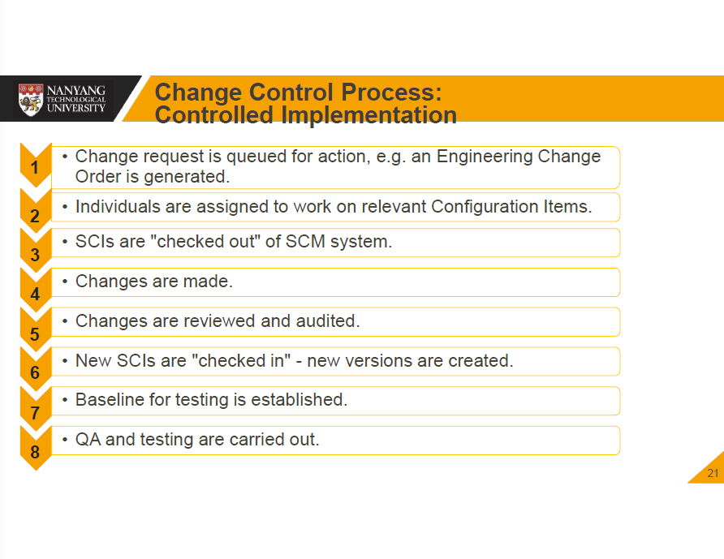
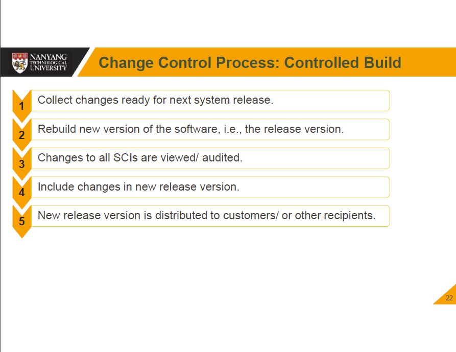

# [Lecture 11](README.md)

## Software System Change

-   Change is inevitable
-   Key problem for organisations is to implement and manage change to existing software systems
-   Contains changes in plan, text, code, data, and other docs
-   Based on baselines

## Repository Features

-   Versioning
-   Dependency tracking and change management
-   Requirements tracing
-   Configuration management
-   Audit trails

## Version Control

-   Project database
-   Version management
-   Make facility
-   Issues tracking

## Change Prediction

-   Predicting the number of changes

## Change Control Boards

-   Project Level CCB/ Software CCB

## Steps of Change Control Process

1.   Software Configuration Identification
2.   Change Requeste (CR) Initiated
3.   CR Analysed
4.   CR Approved
5.   Change Implemented and Unit Tested
6.   Change Integrated
7.   Change Validated
8.   CR Closed

## Controlled Implementation & Build

