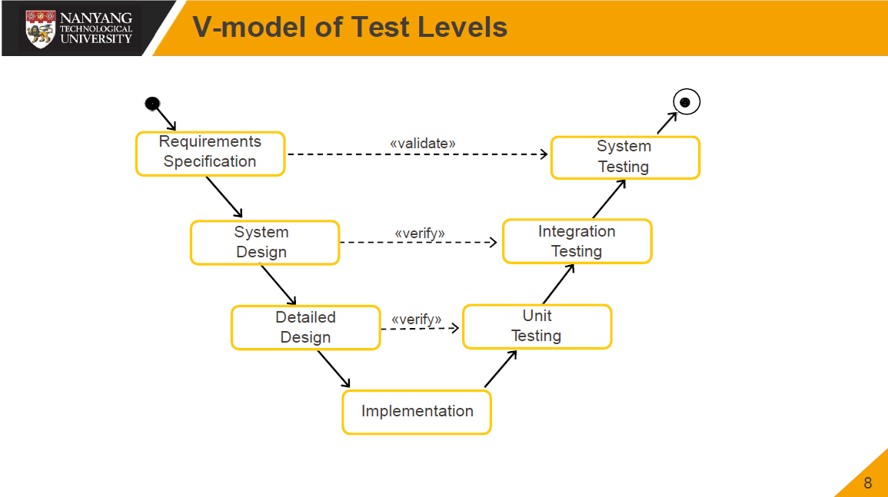
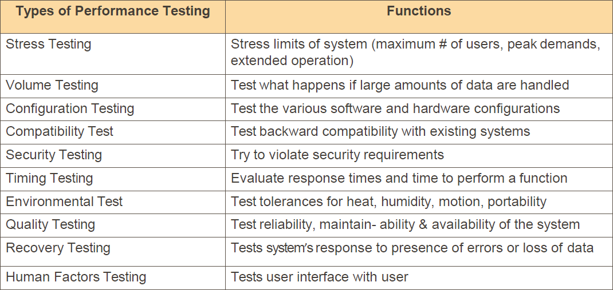

# [Lecture 14](README.md)

## Definition and Scope

-   An activity performed for evaluating product quality and for improving it, by identifying defects and problems
-   Consists of dynamic verification of programme behaviour on a finite set of test cases, suitably selected from the usually infinite executions domain, against the expected behaviour

## Objectives

-   Uncover as manny errors or bugs as possible in a given timeline
-   Demonstrate that a given software product matches its requirement specifications
-   Validate the quality of a software testing using the minimum cost and effort
-   Generate high quality test cases, perform effective tests, and issue correct and helpful problem reports

## Fundamentals

### Test Levels

-   Unit Test
-   Integration Test
-   System Test

### Test Techniques

-   Behavioural (Black)
-   Structural (White)

### Test-Related Measures

-   Fault density
-   Coverage

### Test Process

-   Test process management
-   Documentation

## White-Box/ Structural Testing

-   Tests designed around knowing the internal design structure

## Black-Box/ Behavioral Testing

-   Tests designed around functional requirements

## V-model of Test Levels

## Faults Introduced V.S. Faults Detected

-   Implementation -> Unit Testing
-   Design -> Integrating Testing
-   Requirements -> System Testing

## Integration Testing

-   Decomposition-Based Integration Testing
    -   Big-Bang
    -   Top-Down
    -   Bottom-Up
    -   Sandwich
    -   Use Case-Driven

## Usage-Based Testing

-   Test envorinment reproduces operational environment of software as closely as possible
-   Inputs assigned probability distribution according to occurrence in actual operation

## System Testing

-   Functional Testing
-   Performance Testing
-   Pilot Testing
-   Acceptance Testing
-   Installation Testing

## Alpha & Beta Test

## Performance Testing

## Software Testing

-   To verify that it satisfies specified requirements
-   To identify differences (failures) between
    -   Expected outcome
    -   Actual outcome

## Terminology

-   Error: Human action that results in a defect in the software
-   Fault: The actual defect in the software as an result of an error
-   Failure: Inability of the software to perform its required function
-   Verification: Attempting to find discrepancy with respect to system requirements
-   Validation: Attempting to find discrepancy with respect to user needs
-   Acceptance Testing: Validation of the product to the user environment

## Testing V.S. Debugging

## Goals of Testing

-   Causing failures
-   A good test demonstrates
    -   software does what it is expected to do
    -   software does not do what it is expected to do
-   A successful test cause failure

## Principles

-   Complete testing not possible
-   Testing work is creative and difficult
-   Testing is to prevent faults
-   Testing is risk-based
-   Testing must be planned
-   Testing requires independence

## Levels of Testing Dependencies

-   Baselined for next level
-   Dependent on lower level
-   Ineffective for lower level fault detection

## Incremental Integration

-   Test one unit alone
-   Integrate another unit tested unit with the unit and test together
-   Top-down & bottom-up & hybrid

## Integrating Testing

-   Conformance to inter-unit communication specifications
-   Tests for adverse side effects
-   Perform after unit development
-   Decide on appropriate grouping

## Other Integration Techniques

-   Critical modules
-   As-available modules
-   Complete skeleton

## Different Testing

### Function Testing

-   Verifies that the system does not meet the system specification

### Regression Testing

-   Verifies that the existing features do not continue to work

### Performance Testing

-   Verifies that the system’s performance requirements are not met

### Stress Testing

-   Testing with peak loads over a period of time

### Background Testing

-   Subjects the system to real loads instead of no load

### Configuration Testing

-   Verifies that the system operates under required logical/ physical device assignment combination

### Recovery Testing

-   Verifies that the system cannot recover from hardware/ software failures, and data errors without losing data or control

### Usability Testing

-   Verifies that the system does not meet the human factors requirements

### Compatibility Testing

-   Verifies that the system does not meet the system compatibility objectives

### Reliability Testing

-   Determines how often the system will fail during a given period of time

### Security Testing

-   Determines whether the system is guarded against unauthorized users

### Volume Testing

-   Verifies that the system cannot handle the volume of data specified