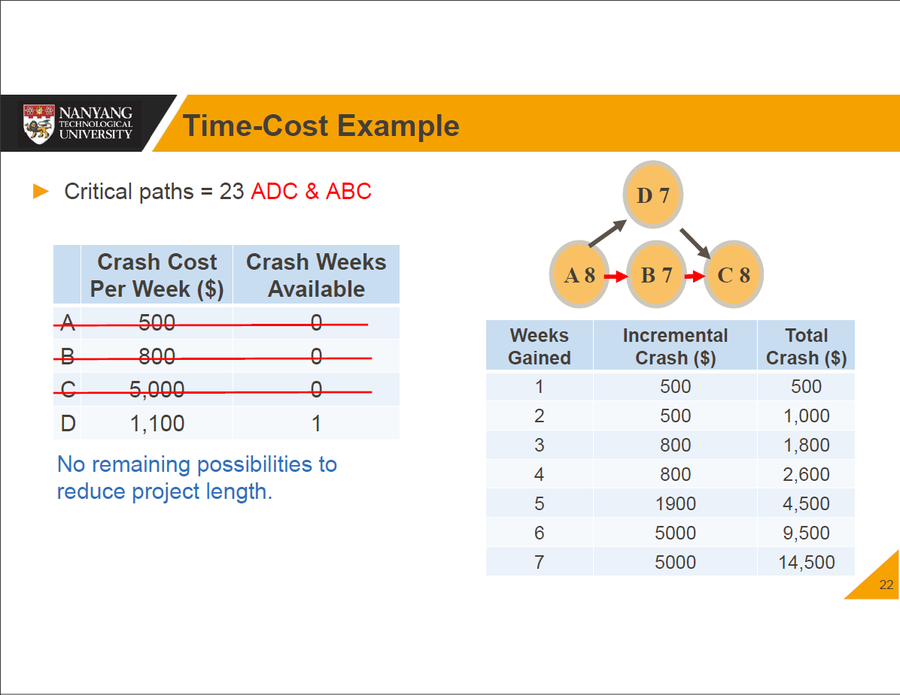

# [Lecture 6](README.md)

## Project Scheduling

-   Establishing objectives
-   Breaking down project into tasks or work packages
-   Estimating time, resources and costs required to complete each task
-   Identifying precedence relationships and sequencing activities
-   Assigning tasks to team members

## Project Scheduling Techniques

-   Bar chart
-   Gannt chart
-   Activity network
-   Critical Path Method (CPM)

## Time-Cost Models

1.   Identify the critical path
2.   Find cost per time unit to expedite each node on critical path
3.   For cheapest node(s) to expedite, reduce it as much as possible, or until critical path changes
4.   Feasible savings?
     1.   yes - return to 1
     2.   no - quit

