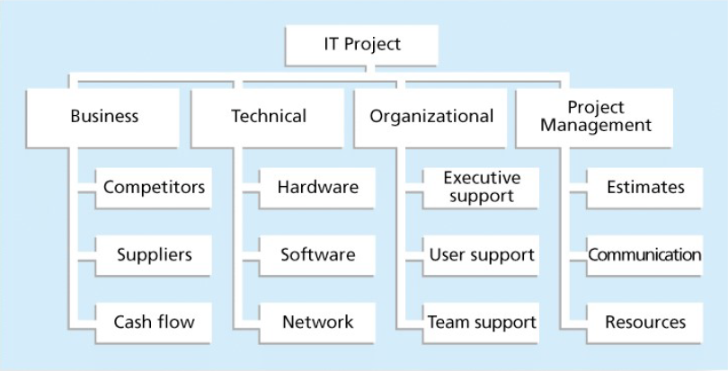
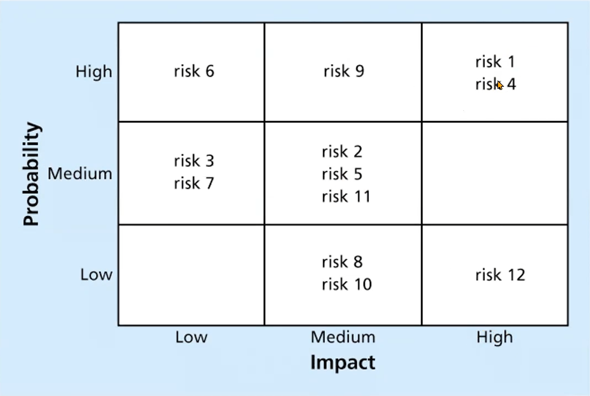

# [Lecture 7](README.md)

-   The importance of Project Risk Management
-   Planning Risk Management
-   Risk Register
-   Performing Quantitative Risk Analysis
-   Residual & Secondary Risk

## Project Planning

-   Time-consuming
-   Continuous activity, and must be revised regularly
-   Various different types may be developed

## A Lifecycle

-   Defines the main activities of steps to accomplish something
-   Provides a framework for
    -   Adopting process, method, tool
    -   Analysing and estimating resources
    -   Studying effectiveness and quality

## Selection of Lifecycles

-   Different lifecycles
    -   Waterfall
    -   Rapid prototyping
    -   Incremental release
    -   Iterative
    -   Spiral
    -   Agile
-   Factors
    -   Organisation & People Factors - skills, maturity, experiences
    -   Client Factors - requirements, expectations
    -   Product Factors - size, complexity
    -   Technology Factors - use of technology

## Defining the Software Development Process

-   contains a set of activities, methods, and practices that are used in the production and evolution
-   integrates people, technology, activities, and products
-   defines quantitative measurement for control
-   has a hierarchical structure
-   lifecycle is the high-level view of the development process
-   Process
    -   Activities
        -   Tasks
        -   Milestones
        -   Check points

## Workbench

-   A planning process
    -   Process
    -   Entry Criteria
    -   Process Description
    -   Milestones
    -   Exit Criteria
-   Work Breakdown

## Risk Management

-   Project risk management is the art and science of identifying, analyzing, and responding to risk throughout the life of a project in the best interests of meeting  project objectives
-   Often overlooked in projects, but it can help improve project success by helping select good projects, determining project scope, and developing realistic estimates

## Negative Risk

-   the possibility of loss or injury
-   involces understanding potential problems
-   negative risk management is an insurance/ investment
-   also have POSITIVE risk

## Risk Utility

-   amount of satisfation or pleasure received from a potential payoff
    -   risk averse
    -   risk seeking
    -   risk neutral

## Project Risk Management Processes

-   Planning
-   Identifying risks
-   Performing qualitative risk analysis
-   Performing quantitative risk analysis
-   Planning risk responses
-   Controlling risk

## Planning Risk Management

-   Risk management plan
-   Review project documents and understand the approaches to risk
-   Level of detail varies

## Contigency and Fallback Plans, Contigency Reserves

-   Contigency plans are predefined actions that the team will take if risk happens
-   Fallback plans are developed for risks that have a high impact on meeting project objectives, and are put into effect if attempts to reduce risks are not effective
-   Contigency reserves or allowances are provisions held by the sponsor to reduce the risk of cost or schedule

## Broad Categories of Risk

-   Market risk
-   Financial risk
-   Technology risk
-   People risk
-   Structure/ process risk

## Risk Breakdown Structure

-   a hierarchy of potential risk categories for a project

    

## Identifying Risks

-   Brainstorming
    -   amassing ideas spontaneously without judgement
    -   not overuse or misuse
-   The Delphi Technique
    -   consensus among a panel of experts
-   Interviewing
    -   people with similar project experience
-   SWOT Analysis
    -   strengths
    -   weakness
    -   opportunities
    -   threats

## Risk Register

-   main output of risk management process is a list of identified risks and other information for registering risk
-   risk register
    -   a document that contains the results of various risk management processes
    -   a tool for documenting potential risk events
-   contents
    -   number
    -   rank
    -   name
    -   description
    -   category
    -   root cause
    -   triggers
    -   responses
    -   owner
    -   impact
    -   status

## Performing Qualitative Risk Analysis

-   Assess the likelihood and impact of identified risks to determine their magnitude and priority
-   Techniques
    -   probability/ impact matrixes
    -   Top Ten Risk Item Tracking
    -   expert judgement

-   Top Ten Risk Item Tracking
    -   periodic review
    -   list of current and past rankings
-   Watch List

## Perform Quantitative Risk Analysis

-   Techniques
    -   Decision tree analysis
    -   Simulation
    -   Sensitivity analysis
-   Decision tree
    -   select the best course of action
    -   Estimated Monetary Value (EMV) - product of a risk probability and risk monetary value
-   Simulation
    -   Monte Carlo analysis
-   Sensitivity analysis
    -   effects of changing one or more variables on an outcome

## Planning Risk Responses

-   Risk avoidance
-   Risk acceptance
-   Risk transference
-   Risk mitigation

## Response for Positive Risks

-   exploitation
-   sharing
-   enhancement
-   acceptance

## Residual and Secondary Risks

-   Residual - risks that remain after all of the response strategies  that have been implemented
-   Secondary - direct result of implementing a risk response

## Controlling Risks

-   executing risk management process to responde to risk events
-   Workarounds are unplanned responses to risk events that must be done when there are no contigency plans
-   Main outputs
    -   work performance information
    -   change requests
    -   updates to the management plan and other docs