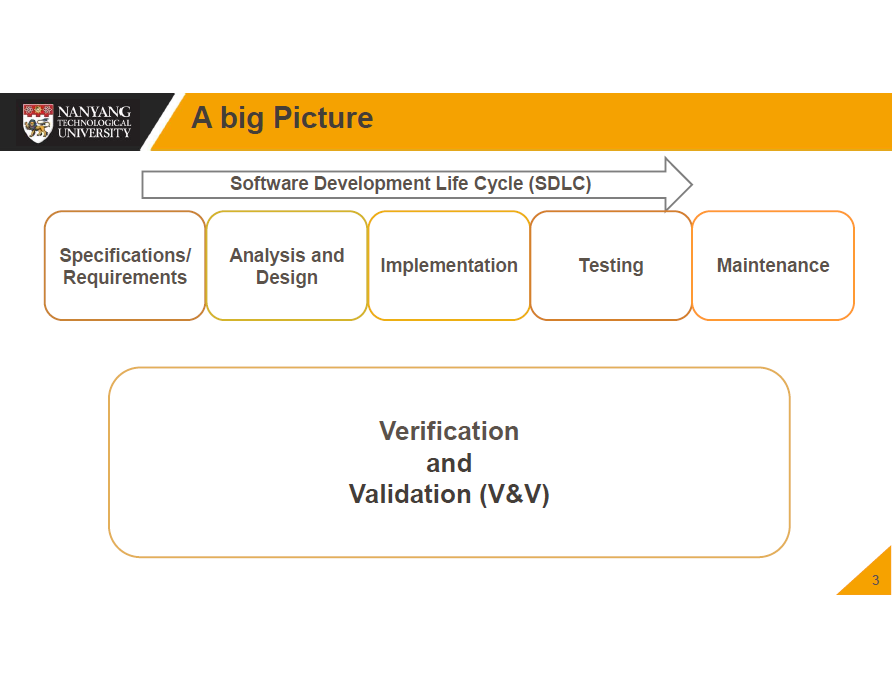

# [Lecture 8](README.md) Verification Methods - Reviews

## A Big Picture

## Purpose of Verification

-   To confirm that the system fulfils the specified design requirements

## Verification Techniques

-   Reviews
-   Prototypes
-   Testing
-   Correctness Proofs
-   Different technique works differently for different faults

## Formal Technical Review

-   Structured enounter in which a group of technical personnel analyses or improves the quality of
    -   Original work product
    -   Method
-   Types
    -   Management reviews - Monitor progress, determine status of plans and schedules, confirm requirements and system allocation, evaluate effectiveness of management approaches
    -   Technical reviews - Determine suitability for intended use, identify discrepancies from approved specs and standards
        -   Inspections
        -   Walk-Throughs
    -   Audits - provide independent evaluation of product conformance to regulations, standards and plans

## Review Objectives

-   technical soundness
-   conformance to requirements
-   conformance to standards
-   consistency between various levels of documents
-   traceability throughout the product life cycle

## Review Steps

-   Preparation (pre-review)
    -   notification, distribution, choose participants
-   Inspection roles
-   Issue classification
-   Review execution
    -   purpose: find errors (not fix)
-   Review follow-up (post-review)