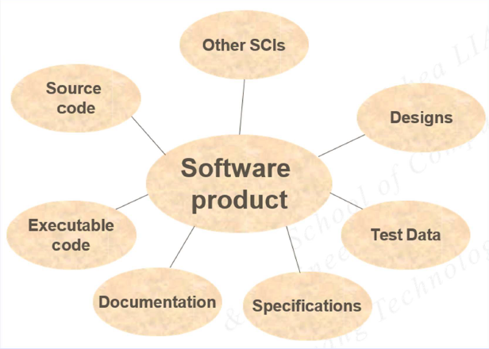

# [Lecture 9](README.md)

## Configuration Management Definition

-   Process of identifying, organizing, and controlling system configuration and change
-   Controlling discipline to maintain system integrity

## Three Parts

-   Change control
-   Version control
-   Product building

## Change Control

-   The management of change as one part of the configuration management process
-   Provide the tools to manage and control change to the system during implementation

## Version Control

-   The management of product versions as part of the configuration management provess
-   Provide the tools to manage and control the product version generated during system implementation

## Product Building

-   The transformation of software and/or documentation source into a deliverable product as one part of the configuration management process
-   Provicde the tools to manage and control an accurate, repeatable, and documentable building process for software and documentation

## Why Software Configuration Management

-   Help organisations/ teams maintain consistency and control over what is produced
-   Ensure the
    -   correct products are delivered (right versions)
    -   products satisfy the requirements (traceability)
    -   software and supporting materials (hardware, documents, training material, etc.) are consistent (system integrity)

## Development Lifecycle

-   Conceptual phase
-   Analysis phase
-   Design phase
-   Implementation phase
-   Testing phase
-   Maintenance phase

## Inherent Properties in Software Development Cycle

-   Requirement change
-   Software change
-   System/ user documentation change
-   Schedules change
-   Staff changes
-   Multiple releases

## Configuration Item

-   A document placed under configuration control
-   Decomposed into further SCIs
-   Modified to create new versions of the original SCIs

## Steps

-   Configuration identification
-   Configuration control
-   Configuration status accounting
-   Configuration audit

## Baseline

-   a foundation on which you build your product
-   a configuration item that has been agreed upon
-   after establishing a baseline, changes to the SCI can only be made under a formal change control procedure

## Change Control - Type of Changes

-   Discrepancies
    -   bug
    -   documented error
    -   development error
    -   violation of dev standard
-   Requested changes
    -   unimplemented requirement
    -   enhancement
    -   improvement

## Change Control Board

-   Principles
-   Characteristics
-   Activities

## Version Tree

-   Created by evolving requirements/ change
-   Required for product support
    -   phased deliveries
    -   incremental releases
    -   specialized products

## Product Building

-   Change-driven
-   Dependent on inter-data file relationships